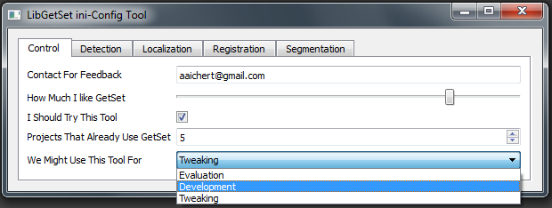

# GetSet - UI-Agnostic Property Abstraction Layer

**GetSet** is a header-only C++ library that provides a unified abstraction layer for managing *typed* and *named* properties organized in a hierarchical tree structure. It handles property change events automatically and enables you to configure your application through multiple frontends without modifying your core algorithm code.

## Core Philosophy

GetSet decouples your application logic from its interface. Define your parameters once, then expose them through different frontends:

- **Configuration Files**: Load/save from INI, XML, or custom formats
- **Command-Line Tools**: Build CLI applications with automatic parameter validation
- **Graphical UIs**: Generate Qt-based GUIs automatically without extra code
- **Python Bindings**: Planned support for Python scripting and automation
- **Custom Frontends**: Add your own UI layer without touching your algorithm



## Key Features

- **Header-Only Core**: Minimal dependencies for maximum portability
- **Type-Safe Properties**: Strongly-typed, compile-time safe property access
- **Hierarchical Organization**: Properties organized in a tree with intuitive path-based naming (e.g., `"Algorithm/StepSize"`)
- **Automatic Event Handling**: Built-in change notifications and event propagation
- **Multiple Frontend Options**: Same code works with INI files, CLI, Qt GUI, or future Python layer
- **Frontend Abstraction**: Swap UI implementations without recompiling your application
- **Zero Coupling**: Core library doesn't depend on Qt or any GUI framework
- **Optional Qt Support**: Rich GUI components available when needed, but not required

## Version

GetSet 2.7.0

## Requirements

- **C++11** or later
- **CMake** 3.5.1 or later
- **Qt5** (optional, only if building GUI components)
  - Qt5Widgets
  - Qt5OpenGL

## Building

### Linux/macOS

```bash
mkdir build
cd build
cmake ..
make
```

### Windows

```bash
mkdir build
cd build
cmake .. -G "Visual Studio 16 2019"
cmake --build . --config Release
```

## Project Structure

- **GetSet/**: Core header-only library providing the abstraction layer
  - Property tree management
  - Event handling and notification
  - I/O support (INI, XML, etc.)
  - *No external dependencies beyond C++11*

- **GetSetGui/**: Optional GUI and frontend utilities
  - Qt5-based widgets and automatic GUI generation
  - Includes both Qt-dependent and Qt-independent utilities
  - Applications can work without linking this if using file-based or CLI configuration

- **Apps/**: Command-line applications and tools
  - Configuration utilities
  - Scripting support

- **Examples/**: Practical demonstrations of different usage patterns
  - `console/`: File-based configuration example
  - `gui/`: Full Qt5 GUI application example
  - `autogui/`: Header-only approach with automatic GUI generation from a separate host process
  - `autogui_header_only/`: Demonstrates decoupled architecture

## Usage Examples

### Core: Define Properties Once

All frontends start the same way - define your typed, named properties:

```cpp
#include "GetSet/GetSet.hxx"

// Define properties in a hierarchical tree
GetSet<int>("Algorithm/Iterations") = 100;
GetSet<double>("Algorithm/Step Size") = 0.01;
GetSet<bool>("Options/Verbose") = true;
GetSet<std::string>("Input/File Path") = "input.dat";
```

### Frontend 1: File-Based Configuration

Load and save parameters from configuration files without any GUI code:

```cpp
#include "GetSet/GetSetIO.h"

// Load from INI file
GetSetIO::load<GetSetIO::IniFile>("config.ini");

// Access values
int iterations = GetSet<int>("Algorithm/Iterations");
double stepSize = GetSet<double>("Algorithm/Step Size");

// Save configuration
GetSetIO::save<GetSetIO::IniFile>("config.ini");
```

### Frontend 2: Header-Only with Automatic GUI

Use the header-only approach with automatic GUI generation, optionally replacing the UI layer:

```cpp
#include "GetSetAutoGui.hxx"

// Define parameters as before
GetSetGui::File("Input/Source")
  .setExtensions("PNG Images (*.png);;All Files (*)")
  = "data.png";

GetSetGui::Enum("Algorithm/Method")
  .setChoices("Fast;Accurate;Balanced")
  = 0;

// Load from file (works without GUI)
GetSetIO::load<GetSetIO::IniFile>("config.ini");

// Access values
std::string file = GetSet<>("Input/Source");
```

### Frontend 3: Qt-Based GUI

For rich graphical interfaces, use GetSetGui with Qt:

```cpp
#include "GetSetGui/GetSetGui.h"

GetSetGui::Application app("MyApplication");

// Define properties with metadata for automatic UI generation
GetSet<int>("Setup/Threads") = 4;
GetSet<double>("Setup/Threshold") = 0.5;

// GetSet automatically generates a GUI from property definitions
// Handles property validation, persistence, and event routing
```

### Key Advantage: Decouple Algorithm from Interface

```
┌──────────────────────────────────────┐
│   Your Algorithm / Core Logic        │
│   (Uses GetSet for parameters)       │
└──────────────────────────────────────┘
            │
            ▼
┌──────────────────────────────────────┐
│   GetSet Property Abstraction Layer  │
└──────────────────────────────────────┘
            │
    ┌───────┼───────┬──────────┐
    ▼       ▼       ▼          ▼
  ┌──┐  ┌────┐  ┌─────┐   ┌───────┐
  │INI│ │CLI │ │ Qt GUI│ │ Python│
  └──┘  └────┘  └─────┘   └───────┘
```

Your algorithm doesn't know or care which frontend is used!

## Architecture & Extensibility

### Header-Only Core

The main `GetSet/` directory provides a header-only library with zero external dependencies. This allows you to:
- Include GetSet in any C++ project without build complications
- Use file-based configuration without linking to Qt or any GUI library
- Compile and deploy command-line tools with minimal dependencies

### Frontend Abstraction

GetSet separates the property abstraction from its presentation layer:

- **Core**: Property tree, type information, event handling
- **Frontends**: Different ways to interact with properties (files, GUI, CLI, Python, etc.)

This design enables:
- Replacing UI implementations without code changes
- Running the same algorithm with different configuration methods
- Adding new frontends (e.g., Python layer) without touching the core library

### Future: Python Integration

GetSet is designed with extensibility in mind. Python bindings and a Python layer can be added to expose the same property abstraction to Python applications and scripts, enabling:
- Python-based automation and scripting
- Integration with scientific Python ecosystem
- Unified parameter management across C++ and Python code

## Documentation

- See [Doxyfile](Doxyfile) for API documentation generation
- Refer to [License.txt](License.txt) for licensing information
- Check out examples in the `examples/` directory for practical usage

## When to Use GetSet

GetSet is ideal for:
- **Scientific applications** with many configurable parameters
- **Algorithms** that should be configurable via multiple interfaces
- **Tools** that need both CLI and GUI variants
- **Projects** where decoupling algorithm from UI is important
- **Applications** requiring flexible parameter management and persistence

## When GetSet Shines

1. **Single Codebase, Multiple UIs**: Write your algorithm once, expose it through INI files, CLI, Qt GUI, or Python
2. **Scalable Configuration**: Hierarchical property tree scales from simple to complex applications
3. **Type Safety**: Compile-time type checking prevents configuration errors
4. **Minimal Dependencies**: Core library has no external dependencies

## License

Licensed under the Apache License, Version 2.0. See [License.txt](License.txt) for details.

```
Copyright (c) by André Aichert (aaichert@gmail.com)

Licensed under the Apache License, Version 2.0 (the "License");
you may not use this file except in compliance with the License.
You may obtain a copy of the License at

  http://www.apache.org/licenses/LICENSE-2.0

Unless required by applicable law or agreed to in writing, software
distributed under the License is distributed on an "AS IS" BASIS,
WITHOUT WARRANTIES OR CONDITIONS OF ANY KIND, either express or implied.
See the License for the specific language governing permissions and
limitations under the License.
```

## Contributing

For issues, questions, or contributions, please contact the author or submit changes through the repository.
